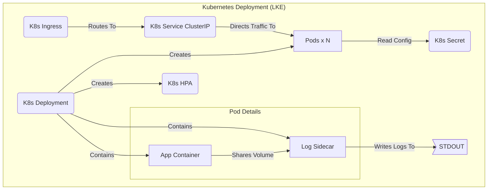

# Rick and Morty SRE Application

## 🚀 Overview

This project implements a highly available, scalable RESTful application that integrates with the public "Rick and Morty" API. It is designed according to **Site Reliability Engineering (SRE) principles** and modern DevOps practices for a production-grade Kubernetes deployment.

The application fetches character data (filtered for Humans, Alive, from Earth), handles external API pagination and rate limits gracefully with retries, persists the data in a PostgreSQL database, and exposes a RESTful API with sorting, health checks, rate limiting, and error handling.

## 🏗️ Architecture

The solution follows a standard cloud-native pattern, emphasizing automation and observability.

* **Application:** Python FastAPI, optimized with `lifespan` for clean startup/shutdown and non-blocking `uvicorn`.
* **Database:** Managed PostgreSQL instance (Provisioned by Terraform).
* **Infrastructure (IaC):** Linode Kubernetes Engine (LKE) cluster and the PostgreSQL database provisioned using **Terraform**.
* **Deployment:** Containerized using an optimized multi-stage **Dockerfile** and deployed via **Helm** chart.
* **CI/CD:** **GitHub Actions** workflow for automated testing, building, and publishing the Docker image.

### Architecture Diagram (Mermaid)


### Pod Architecture Detail


## 📊 Core Technologies & Libraries

The application leverages a carefully selected stack of libraries for its SRE-focused implementation:

* **FastAPI** - Modern, high-performance web framework with automatic OpenAPI documentation
* **SQLAlchemy** - ORM for database interactions with connection pooling and session management
* **Prometheus Client** - Metrics collection and exposure for monitoring
* **Tenacity** - Sophisticated retry logic to handle transient failures
* **SlowAPI** - Rate limiting to protect application resources
* **Requests** - HTTP client for external API communication
* **Uvicorn** - ASGI server for high-throughput asynchronous processing

## 🔄 API Endpoints

The application exposes several key REST endpoints:

### 1. Character Data API
```
GET /api/v1/characters
```
* **Purpose**: Retrieves all cached Rick and Morty characters matching the filtering criteria
* **Query Parameters**:
  * `sort_by`: Sort results by "name" or "id"
* **Rate Limit**: 20 requests per minute
* **Response**: JSON array of character objects

### 2. Data Synchronization
```
POST /sync
```
* **Purpose**: Triggers a manual data sync from the Rick and Morty API
* **Rate Limit**: Stricter limit of 5 requests per minute (resource-intensive operation)
* **Features**: Implements retries with exponential backoff to handle rate limits
* **Response**: Confirmation message with the count of characters processed

### 3. Health Monitoring
```
GET /healthcheck
```
* **Purpose**: Deep health check for Kubernetes readiness probes
* **Features**: Validates database connectivity with a lightweight query
* **Response**: 200 OK if healthy, 503 Service Unavailable if database connection fails

### 4. Metrics Endpoint
```
GET /metrics
```
* **Purpose**: Exposes Prometheus-formatted metrics for monitoring
* **Metrics Collected**:
  * `http_request_duration_seconds` - Request latency histograms
  * `http_errors_total` - Error counts by endpoint and status code
  * `app_processed_characters_count` - Business metric showing processed data volume

## ✨ SRE & DevOps Implementation Details

### 1. Observability (Metrics & Health Checks)
* **Prometheus Metrics:** The `/metrics` endpoint exposes request latency, error rates, and the business metric: `app_processed_characters_count`.
* **Deep Health Check:** The `/healthcheck` endpoint validates **database connectivity**, crucial for **Kubernetes Readiness Probes**.
* **Logging:** The Helm chart includes a **Fluent-bit sidecar container** for reliable log aggregation.

### 2. Resilience and Security
* **Resilience (Retries):** Data ingestion uses `tenacity` to automatically handle transient external API failures (e.g., 429/5xx).
* **Rate Limiting:** Public endpoints are protected using `slowapi`.
* **Security (Secrets):** The application is configured to read the `DATABASE_URL` from a **Kubernetes Secret** (created by Terraform), preventing hardcoding of credentials.
* **Security (Container):** The `Dockerfile` uses **multi-stage build** and runs the application as a **non-root user** for enhanced security.

### 3. CI/CD Gating (GitHub Actions)
The pipeline enforces a strict quality gate:
* **Linting:** Runs `ruff` for code quality checks.
* **Testing:** Runs `pytest` for both **Unit** and **Integration** tests.
* **Deployment Gating:** The build/push job only runs if all tests and checks pass, and only on push to the main branch.

## 🛡️ Resilience & Failover Features

The application includes multiple reliability features:

1. **Database Failover**: Automatic SQLite fallback if no PostgreSQL connection is available:
```python
   # Automatically detects environment and configures appropriate database
   DATABASE_URL = os.getenv("DATABASE_URL")
   if not DATABASE_URL:
       print("WARNING: DATABASE_URL not set. Falling back to local 'sqlite:///./test.db'")
       DATABASE_URL = "sqlite:///./test.db"
```

2. **External API Resilience**:
```python
   @retry(stop=stop_after_attempt(5), wait=wait_exponential(multiplier=1, min=2, max=10))
   def resilient_request(url: str) -> dict:
       # Intelligent retry logic for external API calls
       # Exponential backoff starting at 2s, doubling with each attempt, up to 10s
       # Stops after 5 attempts
```

3. **Graceful Lifecycle Management**: Uses modern `asynccontextmanager` for proper startup/shutdown sequences.

## 🧪 Testing Strategy

The project implements a layered testing strategy:

1. **Unit Tests** (`tests/unit/`):
   * Focus on individual functions in isolation
   * Mock external dependencies (database, API)
   * Verify business logic correctness
   * Fast execution for quick developer feedback

2. **Integration Tests** (`tests/integration/`):
   * Test complete API flows end-to-end
   * Use test database (SQLite) for data persistence
   * Verify component interactions
   * Validate error handling and edge cases

## 🛠️ Setup & Local Development

### 1. Clone and Setup Venv:
```bash
git clone <repository-url>
cd rick-and-morty-app
python3 -m venv .venv
source .venv/bin/activate
pip install -r requirements-dev.txt 
```

### 2. Run Tests:
```bash
python -m pytest 
```

### 3. Run Locally (SQLite Fallback):
The app uses `sqlite:///./test.db` automatically if no `DATABASE_URL` is set.
```bash
uvicorn app.main:app --host 0.0.0.0 --port 8000 --reload
```

Access docs at [http://localhost:8000/docs](http://localhost:8000/docs).

## ☁️ Infrastructure Deployment (Terraform & Helm)

### Terraform (IaC)
1. **Configure Credentials:** 
   Ensure your `linode_token` and `db_password` are set securely (e.g., in Terraform Cloud or a local `terraform.tfvars`).

2. **Initialize and Provision:**
```bash
   cd terraform
   terraform init
   terraform apply
```
   This creates the LKE cluster, PostgreSQL database, and necessary Kubernetes Secret.

### Helm Deployment (CD)
1. **Configure Environment:** 
   The Deployment template is configured to read `DATABASE_URL` from the K8s Secret named `rickmorty-db-creds`.

2. **Deploy:**
```bash
   # Set KUBECONFIG
   export KUBECONFIG=$(terraform output -raw kubeconfig_path)

   # Deploy the application
   cd charts/rick-and-morty-api 
   helm upgrade --install rick-morty-release . --namespace default -f values.yaml
```

3. **Verify Deployment:**
```bash
   # Check if pods are running
   kubectl get pods

   # Verify the ingress is correctly configured
   kubectl get ingress

   # Test the API endpoint
   curl http://<ingress-ip>/healthcheck
```

## 🔧 Advanced Configuration

The application can be configured via environment variables:

| Variable | Purpose | Default |
|----------|---------|---------|
| `DATABASE_URL` | Connection string for PostgreSQL | Falls back to SQLite |
| `LOG_LEVEL` | Logging verbosity | `"INFO"` |

## 📚 API Documentation

Interactive OpenAPI documentation (Swagger UI) is available at the `/docs` endpoint of your deployed application.

## ⏭️ Future Improvements

* **Continuous Deployment (CD):** While CI is complete, fully automated CD within the pipeline (e.g., running Kind/Minikube and deploying Helm) was not implemented. The provided IaC and Helm chart enable a secure, manual or GitOps-based deployment workflow.

* **Distributed Tracing:** Implementing OpenTelemetry for enhanced visibility across service boundaries.

* **Full CI/CD Automation:** Complete the deployment pipeline with automated deployment to test environments using Kind/Minikube.