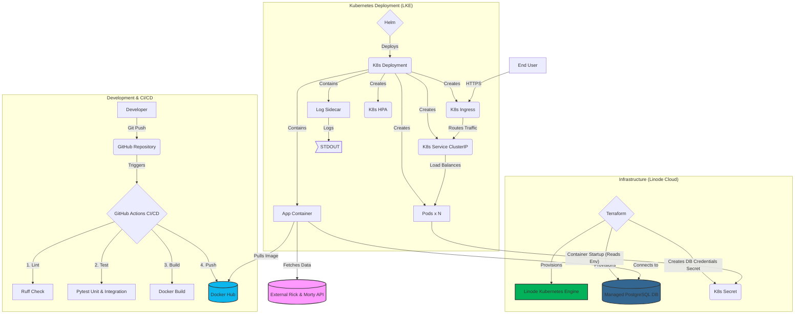

# Rick and Morty SRE Application

## 🚀 Overview

This project implements a highly available, scalable RESTful application that integrates with the public "Rick and Morty" API. It is designed according to **Site Reliability Engineering (SRE) principles** and modern DevOps practices for a production-grade Kubernetes deployment.

The application fetches character data (filtered for Humans, Alive, from Earth), handles external API pagination and rate limits gracefully with retries, persists the data in a PostgreSQL database, and exposes a RESTful API with sorting, health checks, rate limiting, and error handling.

---

## 🏗️ Architecture

The solution follows a standard cloud-native pattern, emphasizing automation and observability.

* **Application:** Python FastAPI, optimized with \`lifespan\` for clean startup/shutdown and non-blocking \`uvicorn\`.
* **Database:** Managed PostgreSQL instance (Provisioned by Terraform).
* **Infrastructure (IaC):** Linode Kubernetes Engine (LKE) cluster and the PostgreSQL database provisioned using **Terraform**.
* **Deployment:** Containerized using an optimized multi-stage **Dockerfile** and deployed via **Helm** chart.
* **CI/CD:** **GitHub Actions** workflow for automated testing, building, and publishing the Docker image.

### Architecture Diagram (Mermaid)

---

## ✨ SRE & DevOps Implementation Details

### 1. Observability (Metrics & Health Checks)
* [cite_start]**Prometheus Metrics:** The \`/metrics\` endpoint exposes request latency, error rates, and the business metric: \`app_processed_characters_count\`[cite: 55, 57, 56].
* [cite_start]**Deep Health Check:** The \`/healthcheck\` endpoint validates **database connectivity**, crucial for **Kubernetes Readiness Probes**[cite: 30].
* [cite_start]**Logging:** The Helm chart includes a **Fluent-bit sidecar container** for reliable log aggregation[cite: 38].

### 2. Resilience and Security
* [cite_start]**Resilience (Retries):** Data ingestion uses \`tenacity\` to automatically handle transient external API failures (e.g., 429/5xx)[cite: 24].
* [cite_start]**Rate Limiting:** Public endpoints are protected using \`slowapi\`[cite: 31].
* [cite_start]**Security (Secrets):** The application is configured to read the \`DATABASE_URL\` from a **Kubernetes Secret** (created by Terraform), preventing hardcoding of credentials[cite: 41].
* [cite_start]**Security (Container):** The \`Dockerfile\` uses **multi-stage build** and runs the application as a **non-root user** for enhanced security[cite: 33, 72, 73].

### 3. CI/CD Gating (GitHub Actions)
[cite_start]The pipeline enforces a strict quality gate[cite: 44]:
* [cite_start]**Linting:** Runs \`ruff\` for code quality checks[cite: 52].
* [cite_start]**Testing:** Runs \`pytest\` for both **Unit** and **Integration** tests[cite: 49, 50].
* [cite_start]**Deployment Gating:** The build/push job only runs if all tests and checks pass, and only on push to the main branch[cite: 45].

---

## 🛠️ Setup & Local Development

1.  **Clone and Setup Venv:**
    \`\`\`bash
    git clone <repository-url>
    cd rick-and-morty-app
    python3 -m venv .venv
    source .venv/bin/activate
    pip install -r requirements-dev.txt 
    \`\`\`
2.  **Run Tests:**
    \`\`\`bash
    python -m pytest 
    \`\`\`
3.  **Run Locally (SQLite Fallback):**
    The app uses \`sqlite:///./test.db\` automatically if no \`DATABASE_URL\` is set.
    \`\`\`bash
    uvicorn app.main:app --host 0.0.0.0 --port 8000 --reload
    \`\`\`
    Access docs at \`http://localhost:8000/docs\`.

---

## ☁️ Infrastructure Deployment (Terraform & Helm)

### **Terraform (IaC)**
1.  **Configure Credentials:** Ensure your \`linode_token\` and \`db_password\` are set securely (e.g., in Terraform Cloud or a local \`terraform.tfvars\`).
2.  **Provision:** \`terraform apply\` (This creates LKE, PostgreSQL, and the necessary K8s Secret).

### **Helm Deployment (CD)**
1.  **Configure Environment:** The Deployment template is configured to read \`DATABASE_URL\` from the K8s Secret named \`rickmorty-db-creds\`.
2.  **Deploy:**
    \`\`\`bash
    # Set KUBECONFIG
    export KUBECONFIG=$(terraform -chdir=terraform output -raw kubeconfig_path)

    # Deploy the application
    cd charts/rick-and-morty-api 
    helm upgrade --install rick-morty-release . --namespace default -f values.yaml
    \`\`\`

---

## 📚 API Documentation

[cite_start]Interactive OpenAPI documentation (Swagger UI) is available at the \`/docs\` endpoint of your deployed application[cite: 68].

---

## ⏭️ Future Improvements

* **Continuous Deployment (CD):** While CI is complete, fully automated CD within the pipeline (e.g., running Kind/Minikube and deploying Helm) was not implemented. The provided IaC and Helm chart enable a secure, manual or GitOps-based deployment workflow.