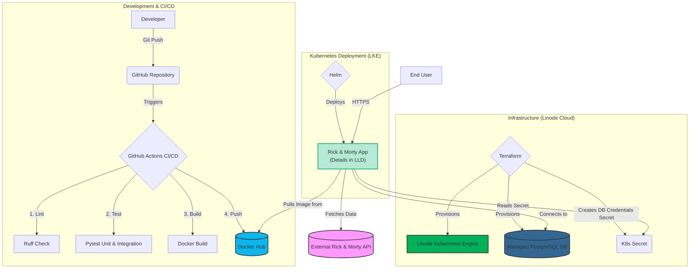
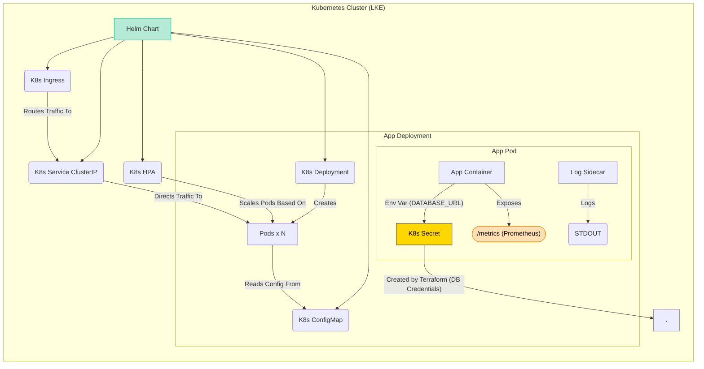

# Rick and Morty SRE Application

## 🚀 Overview

This project implements a highly available, scalable RESTful application that integrates with the public "Rick and Morty" API. It is designed according to **Site Reliability Engineering (SRE) principles** and modern DevOps practices for a production-grade Kubernetes deployment.

The application fetches character data (filtered for Humans, Alive, from Earth), handles external API pagination and rate limits gracefully with retries, persists the data in a PostgreSQL database, and exposes a RESTful API with sorting, health checks, rate limiting, and error handling.

## 🏗️ Architecture

The solution follows a standard cloud-native pattern, emphasizing automation and observability.

* **Application:** Python FastAPI, optimized with `lifespan` for clean startup/shutdown and non-blocking `uvicorn`.
* **Database:** Managed PostgreSQL instance (Provisioned by Terraform).
* **Infrastructure (IaC):** Linode Kubernetes Engine (LKE) cluster and the PostgreSQL database provisioned using **Terraform**.
* **Deployment:** Containerized using an optimized multi-stage **Dockerfile** and deployed via **Helm** chart.
* **CI/CD:** **GitHub Actions** workflow for automated testing, building, and publishing the Docker image.

### Architecture Diagram


### Helm Deployment Architecture Detail


## 📊 Core Technologies & Libraries

The application leverages a carefully selected stack of libraries for its SRE-focused implementation:

* **FastAPI** - Modern, high-performance web framework with automatic OpenAPI documentation
* **SQLAlchemy** - ORM for database interactions with connection pooling and session management
* **Prometheus Client** - Metrics collection and exposure for monitoring
* **Tenacity** - Sophisticated retry logic to handle transient failures
* **SlowAPI** - Rate limiting to protect application resources
* **Requests** - HTTP client for external API communication
* **Uvicorn** - ASGI server for high-throughput asynchronous processing

## 🔄 API Endpoints

The application exposes several key REST endpoints:

### 1. Character Data API
```
GET /api/v1/characters
```
* **Purpose**: Retrieves all cached Rick and Morty characters matching the filtering criteria
* **Query Parameters**:
  * `sort_by`: Sort results by "name" or "id"
* **Rate Limit**: 20 requests per minute
* **Response**: JSON array of character objects

### 2. Data Synchronization
```
POST /sync
```
* **Purpose**: Triggers a manual data sync from the Rick and Morty API
* **Rate Limit**: Stricter limit of 5 requests per minute (resource-intensive operation)
* **Features**: Implements retries with exponential backoff to handle rate limits
* **Response**: Confirmation message with the count of characters processed

### 3. Health Monitoring
```
GET /healthcheck
```
* **Purpose**: Deep health check for Kubernetes readiness probes
* **Features**: Validates database connectivity with a lightweight query
* **Response**: 200 OK if healthy, 503 Service Unavailable if database connection fails

### 4. Metrics Endpoint
```
GET /metrics
```
* **Purpose**: Exposes Prometheus-formatted metrics for monitoring
* **Metrics Collected**:
  * `http_request_duration_seconds` - Request latency histograms
  * `http_errors_total` - Error counts by endpoint and status code
  * `app_processed_characters_count` - Business metric showing processed data volume

## ✨ SRE & DevOps Implementation Details

### 1. Observability (Metrics & Health Checks)
* **Prometheus Metrics:** The `/metrics` endpoint exposes request latency, error rates, and the business metric: `app_processed_characters_count`.
* **Deep Health Check:** The `/healthcheck` endpoint validates **database connectivity**, crucial for **Kubernetes Readiness Probes**.
* **Logging:** The Helm chart includes a **Fluent-bit sidecar container** for reliable log aggregation.

### 2. Resilience and Security
* **Resilience (Retries):** Data ingestion uses `tenacity` to automatically handle transient external API failures (e.g., 429/5xx).
* **Rate Limiting:** Public endpoints are protected using `slowapi`.
* **Security (Secrets):** The application is configured to read the `DATABASE_URL` from a **Kubernetes Secret** (created by Terraform), preventing hardcoding of credentials.
* **Security (Container):** The `Dockerfile` uses **multi-stage build** and runs the application as a **non-root user** for enhanced security.

### 3. CI/CD Gating (GitHub Actions)
The pipeline enforces a strict quality gate:
* **Linting:** Runs `ruff` for code quality checks.
* **Testing:** Runs `pytest` for both **Unit** and **Integration** tests.
* **Deployment Gating:** The build/push job only runs if all tests and checks pass, and only on push to the main branch.

## 🛡️ Resilience & Failover Features

The application includes multiple reliability features:

1. **Database Failover**: Automatic SQLite fallback if no PostgreSQL connection is available:
```python
   # Automatically detects environment and configures appropriate database
   DATABASE_URL = os.getenv("DATABASE_URL")
   if not DATABASE_URL:
       print("WARNING: DATABASE_URL not set. Falling back to local 'sqlite:///./test.db'")
       DATABASE_URL = "sqlite:///./test.db"
```
#### 🛡️ Failover test results
```bash
➜  rick-and-morty-app git:(feat/check-failover) ✗ kubectl logs rick-morty-dev-rick-and-morty-api-5d46bc47b4-mdfhd -n rick-morty-ns
Defaulted container "rick-and-morty-api" out of: rick-and-morty-api, logging-sidecar
**WARNING: DATABASE_URL not set. Falling back to local 'sqlite:///./test.db'**
INFO:     Started server process [1]
INFO:     Waiting for application startup.
--- Application starting up... ---
--- Database initialized ---
INFO:     Application startup complete.
INFO:     Uvicorn running on http://0.0.0.0:8000 (Press CTRL+C to quit)
INFO:     172.104.134.228:42284 - "GET /healthcheck HTTP/1.1" 200 OK
INFO:     172.104.134.228:42298 - "GET /healthcheck HTTP/1.1" 200 OK
INFO:     172.104.134.228:35346 - "GET /healthcheck HTTP/1.1" 200 OK
INFO:     172.104.134.228:35360 - "GET /healthcheck HTTP/1.1" 200 OK
INFO:     172.104.134.228:50384 - "GET /healthcheck HTTP/1.1" 200 OK
```

2. **External API Resilience**:
```python
   @retry(stop=stop_after_attempt(5), wait=wait_exponential(multiplier=1, min=2, max=10))
   def resilient_request(url: str) -> dict:
       # Intelligent retry logic for external API calls
       # Exponential backoff starting at 2s, doubling with each attempt, up to 10s
       # Stops after 5 attempts
```

3. **Graceful Lifecycle Management**: Uses modern `asynccontextmanager` for proper startup/shutdown sequences.

## 🧪 Testing Strategy

The project implements a layered testing strategy:

1. **Unit Tests** (`tests/unit/`):
   * Focus on individual functions in isolation
   * Mock external dependencies (database, API)
   * Verify business logic correctness
   * Fast execution for quick developer feedback

2. **Integration Tests** (`tests/integration/`):
   * Test complete API flows end-to-end
   * Use test database (SQLite) for data persistence
   * Verify component interactions
   * Validate error handling and edge cases

## 🛠️ Setup & Local Development

### 1. Clone and Setup Venv:
```bash
git clone <repository-url>
cd rick-and-morty-app
python3 -m venv .venv
source .venv/bin/activate
pip install -r requirements-dev.txt 
```

### 2. Run Tests:
```bash
python -m pytest 
```

### 3. Run Locally (SQLite Fallback):
The app uses `sqlite:///./test.db` automatically if no `DATABASE_URL` is set.
```bash
uvicorn app.main:app --host 0.0.0.0 --port 8000 --reload
```

## 🧪 Testing API Endpoints

### Local Testing

After running the application locally, you can test the endpoints:
```bash
# Initial health check
curl http://localhost:8000/healthcheck
# Expected: {"status":"OK","db_status":"Healthy"}

# Sync data from Rick & Morty API
curl -X POST http://localhost:8000/sync
# Expected: {"message":"Data synced successfully: XX characters processed"}

# Get all characters
curl http://localhost:8000/api/v1/characters
# Returns JSON array of character objects

# Get characters sorted by name
curl http://localhost:8000/api/v1/characters?sort_by=name

# Check Prometheus metrics
curl http://localhost:8000/metrics
# Returns raw Prometheus metrics
```

### Production Testing

After deployment to Kubernetes, test with the ingress IP or hostname:
```bash
# Get the ingress IP/hostname
INGRESS_HOST=$(kubectl get ingress rick-morty-release -o jsonpath='{.status.loadBalancer.ingress[0].ip}')

# Health check
curl http://$INGRESS_HOST/healthcheck

# Test character endpoint
curl http://$INGRESS_HOST/api/v1/characters?sort_by=name

# Test rate limiting (will return 429 after exceeding limits)
for i in {1..6}; do 
  curl -X POST http://$INGRESS_HOST/sync
  echo "Request $i completed"
  sleep 1
done
```

> **Note**: As per the SRE assignment requirements, rate limiting is implemented to ensure resource protection:
> - `/sync` endpoint is limited to **5 requests per minute** (due to resource intensity)
> - `/api/v1/characters` endpoint is limited to **20 requests per minute**

Access docs at [http://localhost:8000/docs](http://localhost:8000/docs).

## ☁️ Infrastructure Deployment (Terraform & Helm)

### Terraform (IaC)
1. **Configure Credentials:** 
   Ensure your `linode_token` and `db_password` are set securely (e.g., in Terraform Cloud or a local `terraform.tfvars`).

2. **Initialize and Provision:**
```bash
   cd terraform
   terraform init
   terraform apply
```
   This creates the LKE cluster, PostgreSQL database, and necessary Kubernetes Secret.

### Helm Deployment (CD)
1. **Configure Environment:** 
   The Deployment template is configured to read `DATABASE_URL` from the K8s Secret named `rickmorty-db-creds`.

2. **Deploy:**
```bash
   # Set KUBECONFIG
   export KUBECONFIG=$(terraform output -raw kubeconfig_path)

   # Deploy the application
   cd charts/rick-and-morty-api 
   helm upgrade --install rick-morty-release . -n rick-morty-ns 
   OR
   helm upgrade --install rick-morty-sqlite . -n rick-morty-ns --set database.type=sqlite
```
**Note:** In case with real DB the application requires Kubernetes node IP addresses to be whitelisted in the database. Future improvement: automate this step with Terraform or a CI/CD pipeline.

3. **Verify Deployment:**
```bash
   # Check if pods are running
   kubectl get pods

   # Verify the ingress is correctly configured
   kubectl get ingress

   # Test the API endpoint
   curl http://<ingress-ip>/healthcheck
```

## 🔧 Advanced Configuration

The application can be configured via environment variables:

| Variable | Purpose | Default |
|----------|---------|---------|
| `DATABASE_URL` | Connection string for PostgreSQL | Falls back to SQLite |
| `LOG_LEVEL` | Logging verbosity | `"INFO"` |

## 📚 API Documentation

Interactive OpenAPI documentation (Swagger UI) is available at the `/docs` endpoint of your deployed application.

## ⏭️ Future Improvements

* **Continuous Deployment (CD):** While CI is complete, fully automated CD within the pipeline (e.g., running Kind/Minikube and deploying Helm) was not implemented. The provided IaC and Helm chart enable a secure, manual or GitOps-based deployment workflow.

* **Distributed Tracing:** Implementing OpenTelemetry for enhanced visibility across service boundaries.

* **Full CI/CD Automation:** Complete the deployment pipeline with automated deployment to test environments using Kind/Minikube.